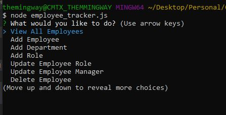
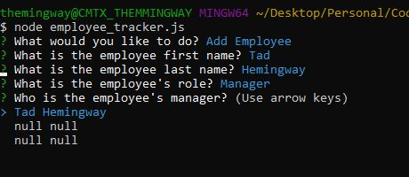
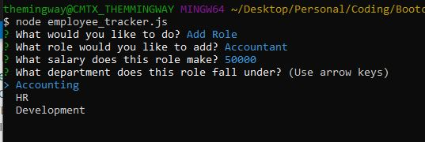

# 12_MySQL_Employee_Tracker
Unit 12 MySQL Homework: Employee Tracker

This assignment is to architect and build a solution for managing a company's employees using node, inquirer, and MySQL.

Database schema:

* **department**:

  * **id** - INT PRIMARY KEY
  * **name** - VARCHAR(30) to hold department name

* **role**:

  * **id** - INT PRIMARY KEY
  * **title** -  VARCHAR(30) to hold role title
  * **salary** -  DECIMAL to hold role salary
  * **department_id** -  INT to hold reference to department role belongs to

* **employee**:

  * **id** - INT PRIMARY KEY
  * **first_name** - VARCHAR(30) to hold employee first name
  * **last_name** - VARCHAR(30) to hold employee last name
  * **role_id** - INT to hold reference to role employee has
  * **manager_id** - INT to hold reference to another employee that manager of the current employee. This field may be null if the employee has no manager

  Technology:

    - MySQL Workbench
    - NodeJs
    - NPM MySQL
    - NPM Inquirer
    - NPM console.table
    - JavaScript

  The command-line application allows users to:

    * Add departments, roles, employees

    * View departments, roles, employees

    * Update employee roles

    * Update employee managers

    * View employees by manager

    * Delete departments, roles, and employees
    
     
     

    

     
     
    

     
     

    